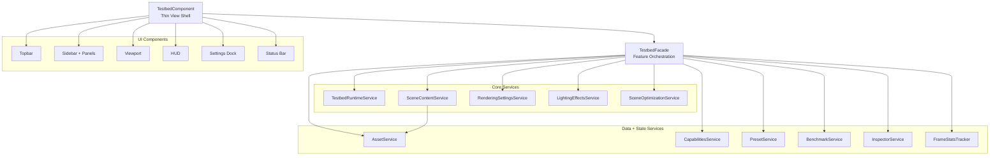

# Three.js Graphics Testbed (Angular)

An Angular 21 + Three.js graphics sandbox for testing renderer modes, post-processing, scene loading, and benchmark capture. The app is route-level lazy loaded and organized around a thin shell component plus focused services.

## What this project does

- Runs a configurable graphics testbed in WebGL or WebGPU.
- Loads scene collections by manifest (with LOD support) and falls back to a procedural demo scene when assets are missing.
- Exposes renderer/scene controls through sidebar panels and an in-viewport Angular settings dock.
- Tracks runtime metrics (FPS, CPU/GPU timing, draw calls, triangles, memory).
- Runs a benchmark camera path and exports a JSON metrics report.

## Brief project logic

- Testbed view shell ([src/app/features/testbed/testbed.component.ts](src/app/features/testbed/testbed.component.ts)) is intentionally thin: it binds template events/signals and delegates behavior.
- Testbed orchestration facade ([src/app/features/testbed/testbed.facade.ts](src/app/features/testbed/testbed.facade.ts)) owns feature state/signals and coordinates lifecycle, rendering updates, scene loading, benchmark flow, and cleanup.
- Runtime setup ([src/app/features/testbed/testbed-runtime.service.ts](src/app/features/testbed/testbed-runtime.service.ts)) builds renderer, scene, camera, controls, composer, and resize behavior.
- Scene content ([src/app/features/testbed/scene-content.service.ts](src/app/features/testbed/scene-content.service.ts)) handles collection manifests, LOD loading, procedural fallback, and active-group lifecycle.
- Rendering effects ([src/app/features/testbed/rendering-settings.service.ts](src/app/features/testbed/rendering-settings.service.ts), [src/app/features/testbed/lighting-effects.service.ts](src/app/features/testbed/lighting-effects.service.ts), [src/app/features/testbed/scene-optimization.service.ts](src/app/features/testbed/scene-optimization.service.ts)) apply tone mapping, post-FX toggles, filtering, lens flares, BVH, and environment/LOD adjustments.
- Metrics + benchmark ([src/app/features/testbed/benchmark.service.ts](src/app/features/testbed/benchmark.service.ts), [src/app/features/testbed/frame-stats-tracker.ts](src/app/features/testbed/frame-stats-tracker.ts), [src/app/features/testbed/inspector.service.ts](src/app/features/testbed/inspector.service.ts)) gather frame stats, benchmark progress, export payload, and scene inspector snapshots.
- Data/persistence ([src/app/features/testbed/asset.service.ts](src/app/features/testbed/asset.service.ts), [src/app/features/testbed/capabilities.service.ts](src/app/features/testbed/capabilities.service.ts), [src/app/features/testbed/preset.service.ts](src/app/features/testbed/preset.service.ts)) provide IO, hardware capability detection, and preset persistence.

## Architecture diagram



## Assets and manifests

The testbed expects a collections index at `/assets/collections-index.json` and optional per-collection manifests. If the index is missing, the app automatically uses a procedural demo scene.

Example collections index:

```json
[
  {
    "id": "the_shed",
    "displayName": "The Shed",
    "manifestUrl": "/assets/collections/the_shed/manifest.json"
  }
]
```

Example manifest:

```json
{
  "name": "the_shed",
  "displayName": "The Shed",
  "thumbnail": "thumbnails/the_shed.png",
  "lods": [
    "export/high/the_shed_LOD0.glb",
    "export/medium/the_shed_LOD1.glb",
    "export/low/the_shed_LOD2.glb"
  ],
  "environment": "hdr/the_shed.hdr"
}
```

## Development

Start dev server:

```bash
npm start
```

Run tests:

```bash
npm test
```

Build:

```bash
npm run build
```

## External references

- Three.js WebGPU parity/status tracker: https://github.com/mrdoob/three.js/issues/29295 (last verified: 2026-02-12)

Default local URL: [http://localhost:4200/](http://localhost:4200/)
